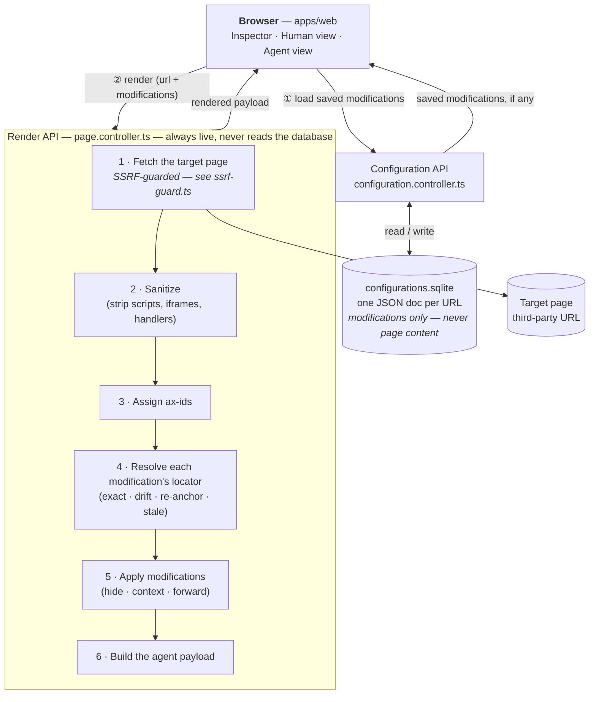

# AX Page Editor

A visual editor that lets a publisher see what an AI agent currently reads from one of their
pages, and correct it: hide what is noise, explain what is ambiguous, and pull in what sits
behind a link. Nothing about the published page changes — what changes is the payload an agent
receives.

Full problem statement and user stories: [`SPEC.md`](SPEC.md). Vocabulary used throughout this
codebase (locator, drift, shadowed, configuration, …): [`CONTEXT.md`](CONTEXT.md). Individual
design decisions: [`docs/adr/`](docs/adr/).

## Demo recording

*(link goes here once recorded)*

A roughly three-minute walkthrough, scripted to this beat sheet before being shot:

1. **Load a page, Agent view.** Show what an agent reads today — navigation, a cookie notice,
   or similar boilerplate sitting at equal weight to the real content.
2. **Select an element** in Human view, pointing out the click-to-select highlight.
3. **Hide it.** Switch to Agent view and show the same element gone from the payload.
4. **Add context** to an element an agent couldn't otherwise make sense of (a chart, a form).
5. **Forward a link.** Select a link, forward it, show its content now inlined in the payload.
6. **Before-and-after answers** — ask an agent the same question against the payload from step 1
   and the payload after steps 3–5, side by side.
7. **Save, then reopen the page** — show the configuration re-applying automatically.
8. **Close by naming one limitation out loud** — e.g. that link forwarding goes one level deep,
   or that JavaScript-rendered content isn't visible to the editor (see Known limitations below).

## Setup and running

**Prerequisite:** Node 24 or later. The server uses Node's built-in `node:sqlite`, which is
stable only from Node 24 on.

From a clean clone:

```bash
npm install        # npm workspaces: apps/*, packages/*
npm run dev         # server on :3001, web on :5173, concurrently
```

Then open `http://localhost:5173`.

Other root-level scripts:

```bash
npm test            # schema, server (jest), web (vitest)
npm run typecheck    # all three packages
npm run build        # schema → server → web, in that order
```

### Environment variables

All optional — the app runs with no `.env` file at all.

| Variable | Optional | Default | Purpose |
|---|---|---|---|
| `PORT` | yes | `3001` | Port the NestJS server listens on. |
| `AX_USER_AGENT` | yes | a descriptive default identifying this tool | User-Agent header sent when fetching a target page. |
| `AX_USE_FIXTURES` | yes | off (`0`) | Set to `1` to serve a small set of committed HTML snapshots (Wikipedia, BBC News, Stripe pricing — see `apps/server/src/fixture-store.ts`) instead of a live fetch, so a demo survives being offline or a live page changing shape mid-review. |

## Architecture

The mental model is a transform: **target page + configuration → agent payload**. A
configuration is never applied to a stored copy of the page — every render re-fetches the page
and re-applies the configuration's modifications fresh ([ADR-0001](docs/adr/0001-modifications-are-data-applied-at-render-time.md)).
Nothing can be served stale, because nothing is materialized; the cost is that drift,
re-anchoring, and going stale are real states a modification can be in, not edge cases.



Two independent request flows, not one — a render never reads the database, and a
configuration save/load never fetches a page. **A previously-saved page's *content* is never
served from SQLite**: only its list of modifications is. Every render re-fetches the target
page live, whether this is the first time it's been opened or the hundredth (ADR-0001) — the
database only ever answers "what did the publisher ask for," never "what does the page say."

**How a modification finds its element.** A modification targets a *locator* — a structural
path plus a content fingerprint — never a live DOM reference, which is what lets it survive
ordinary site edits. `resolveLocator` grades the result into four tiers: `exact`, `drift`
(position holds, content changed), `re-anchor` (position gone, fingerprint found elsewhere), or
`stale` (neither). Hide, context, and forward each react to drift differently — a context note
gets flagged "needs review" on drift, since its point may no longer hold; a hide and a forward
apply through drift and re-anchor unchanged. Details: [ADR-0003](docs/adr/0003-composite-locator-with-graded-resolution.md).

The tier itself is internal — it decides behavior server-side (needs-review, shadowing,
whether a stale locator counts as "unresolved") but is never sent to the browser as a raw
value. The publisher only ever sees the *consequence*: an "Unresolved" badge (`stale`), a
"Shadowed" badge (resolved, but inside a hidden ancestor), or a "Needs review" badge (a context
note on `drift`) — never the tier name itself.

**Where a context note lives in the payload.** As a real, parseable text node next to its
target element (`<span data-ax-context>` in HTML, an adjacent block in Markdown) — never as a
`data-*` attribute alone, an HTML comment, or an `aria-label`. Most agents flatten a page to
text, strip attributes, or drop comments; anything an agent might discard defeats the entire
point of the feature. The `data-ax-*` attributes remain as provenance markers, not as the
carrier. Details: [ADR-0004](docs/adr/0004-context-notes-are-delivered-as-real-text.md).

**Storage.** One JSON document per normalized URL, in SQLite, behind a repository interface
(`ConfigurationRepository`). A configuration is always read and written whole — nothing queries
into it — so document-shaped storage is correct here, not just convenient, and SQLite needs no
running server, which matters when the reader of this repo has to get it running from a clean
clone. **Production alternative:** Postgres with JSONB once there are multiple tenants and
concurrent editors — the repository interface is what makes that a single-file change rather
than a claim in a README. At real scale, the agent read path wouldn't hit a database at all;
compiled payloads belong in an edge key-value store with page-change invalidation. Details:
[ADR-0007](docs/adr/0007-sqlite-document-storage-behind-a-repository.md).

### Module map

| Path | Responsibility |
|---|---|
| `packages/schema` | `Locator`, `Modification`, `Configuration` types and Zod schemas — shared by client and server. |
| `apps/server/src/{fetcher,sanitizer,ssrf-guard,base-href}.ts` | Fetch a target URL safely, strip active content, and rewrite relative URLs so the fetched page renders correctly outside its original origin. |
| `apps/server/src/{resolve-locator,apply-modifications}.ts` | The resolution/application pipeline described above. |
| `apps/server/src/agent-payload.ts` | Builds the Markdown/HTML representation an agent receives. |
| `apps/server/src/configuration-repository.ts` | SQLite-backed save/load, one row per URL. |
| `apps/web/src/iframe-overlay.ts` | Injected into the sandboxed preview iframe — click-to-select, locator building, and on-page marks. Hand-duplicates the schema package's locator algorithm in plain JS, since a sandboxed `srcDoc` can't import a module (guarded by a dedicated parity test, see Testing below). |
| `apps/web/src/{Inspector,ReviewPanel,ModificationNavigator}.tsx` | The publisher-facing controls: per-element actions, the full modification list, and the jump-to-change navigator in Agent view. |
| `apps/web/src/AgentPayloadView.tsx` | Renders the agent payload in either format and marks modification-added blocks. |

## Security

This app fetches and renders arbitrary third-party URLs a publisher supplies, which is the
actual attack surface worth documenting:

- **SSRF guard** (`ssrf-guard.ts`) — before fetching, resolves the URL's hostname via DNS and
  checks the *resolved IP*, not just the hostname string, against loopback, private (RFC 1918),
  link-local/cloud-metadata, and CGNAT ranges, including the IPv4-mapped-IPv6 bypass
  (`::ffff:a.b.c.d`). Restricted to `http:`/`https:` only. Caveat worth naming plainly: this is a
  resolve-then-fetch check, so a determined DNS-rebinding attack in the window between the two
  is a known class of gap it doesn't fully close.
- **Server-side sanitization** (`sanitizer.ts`) — every fetched page has `<script>` and
  `<iframe>` tags removed, event-handler attributes stripped, and `javascript:` URLs (including
  obfuscated variants) neutralized before it ever reaches the browser.
- **Sandboxed preview iframe** ([ADR-0005](docs/adr/0005-sandboxed-iframe-preview.md)) — Human
  view loads with `sandbox="allow-scripts"` and no `allow-same-origin`, so even the app's own
  injected overlay script runs with an opaque origin and no access to the parent page or its
  cookies.

## Special capabilities beyond the spec

The three required features are Hide, Context, and Link Forwarding. Beyond those:

- **Graded locator resolution** (exact / drift / re-anchor / stale) — a modification survives
  ordinary site markup changes instead of silently breaking the first time the page is edited.
- **Shadowing** — a modification whose locator resolves inside a hidden ancestor's subtree is
  tracked as "shadowed," not applied and not deleted, and comes back automatically if the
  ancestor is later unhidden.
- **"Needs review"** — a context note whose underlying content has drifted since it was written
  is flagged for the publisher, without being silently dropped or silently kept as if nothing
  changed.
- **Multi-element selection** — shift/ctrl-click to select several elements at once and apply
  hide, context, or forwarding to all of them in one action.
- **Broad-failure detection** — when a large share of a configuration's modifications fail to
  resolve at once (most likely: this configuration belongs to a different page, or the page
  changed shape entirely), the review list reports one page-level message instead of repeating
  "unresolved" on every row.
- **Undo / Reset**, with Reset itself undoable — a full history stack, not just the ability to
  remove one modification at a time.
- **Client/server locator-parity test** — the sandboxed iframe hand-duplicates the schema
  package's locator algorithm in plain JS; a dedicated test evaluates the actual compiled
  overlay script against the same elements the server sees, so the two silently drifting apart
  fails a test rather than surfacing only as a hide that mysteriously stops working.
- **Base-href rewriting** — a fetched page's relative URLs (CSS, images, links) are rewritten to
  resolve against their real origin, so the Human-view preview actually looks like the target
  page instead of a page missing every relatively-linked asset.

## Known limitations

Stated plainly rather than left to be discovered:

- **No JavaScript execution.** The target page's own scripts are stripped entirely before
  rendering (see Security). A page that renders its content client-side — an SPA framework, a
  lazy-loaded widget — shows only its static HTML today; nothing produced by its own scripts is
  visible or selectable.
- **Robots directives are not read.** `robots.txt` and `<meta name="robots">` are not consulted
  before fetching a target page or a forwarded link.
- **Link forwarding goes one level deep.** A forwarded link's content is fetched and inlined
  once; a link inside that fetched content is not itself followed or forwarded.
- **Single user, single global store.** Configurations are keyed only by URL, in one SQLite
  file, with no authentication or per-publisher isolation — anyone with access to the app can
  edit any URL's configuration.
- **Agent view and Human view each fetch the target page independently.** A page whose markup
  order shifts between those two fetches (a rotating ad, an A/B-tested layout, any live
  re-render) can get different ax-ids between the two views for what is visually the same
  element. A single shared fetch per load, or a content-based match instead of a positional one,
  is deferred to whenever compare mode (see Future work) needs it solved for real.

## Ambiguities decided

Where the spec and user stories left a call open, the decision and its reasoning live in
[`docs/adr/`](docs/adr/) rather than repeated here — in particular how a locator survives page
changes ([ADR-0003](docs/adr/0003-composite-locator-with-graded-resolution.md)), why hiding
removes content outright rather than styling it away ([ADR-0002](docs/adr/0002-hiding-removes-content-from-the-payload.md)),
and where a context note is placed in the payload ([ADR-0004](docs/adr/0004-context-notes-are-delivered-as-real-text.md)).

## Future work

- **Multi-page support** — a configuration currently belongs to exactly one URL; managing a
  whole site's worth of pages from one place is a natural next step.
- **Suggested realignment for drifted or stale modifications** — today the publisher is only
  told a modification's target changed or disappeared (drift, re-anchor, stale — see
  Architecture above); the tool never proposes a fix. A natural extension is surfacing a likely
  replacement element (by structural or textual similarity to the original) so fixing a broken
  modification after a site edit is a one-click accept rather than a manual re-select.
- **A unified editor** instead of separate Agent/Human view tabs — watch a change land in the
  agent payload as you make it on the human page, rather than toggling and remembering. (Scoped
  already as compare mode, see `docs/adr/` and the Linear backlog — not built yet.)
- **Grouping and search for a large number of modifications** — the review list and navigator
  are flat lists today; a page with dozens of modifications would benefit from grouping by
  section or type, and a search/filter box.
- **Move to Postgres** — see the Storage section above; the repository interface exists
  specifically to make this a contained change.
- **JavaScript rendering in the preview** — see Known limitations. Doing this safely likely
  means rendering server-side in a headless browser before sanitizing, rather than relying on
  iframe sandboxing alone, which is a meaningfully bigger security surface than the current
  approach and a deliberate reason it isn't done yet.
- **A browser extension for in-context marking** — overlay the same select/hide/context/forward
  UI directly on the live site as the publisher browses it, instead of only through a fetched
  copy in this app. This would naturally solve the JavaScript-rendering limitation too, since an
  extension sees the page's fully-rendered DOM. The modification model (`Locator` +
  `Modification` in `packages/schema`) is already decoupled from how an element was found, so
  this is a plausible extension point rather than a rewrite.
- **Testing against a real agent** — validating that an actual agent's answers change the way
  a modification intends, not just that the payload contains the expected markup.
- **Saved-configuration history** — only the latest save is kept per URL today; versioning would
  let a publisher see or revert past states.
- **A payload signal-to-noise indicator** — surfacing how much of the agent payload is the
  publisher's own content versus original page boilerplate, so the effect of a round of edits is
  visible as a number, not just a feeling.

## Testing

`npm test` from the root runs all three packages: `packages/schema`, `apps/server` (Jest — the
resolution/application pipeline, sanitizer, SSRF guard, and the client/server locator-parity
test), and `apps/web` (Vitest — pure functions only: label building, filtering, serialization;
no component-rendering test harness is set up, so UI behavior is verified live in the browser
rather than through simulated DOM tests).
